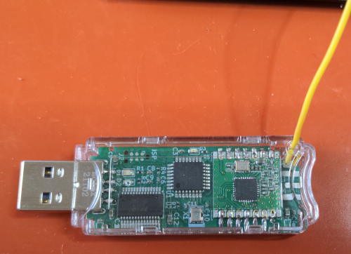
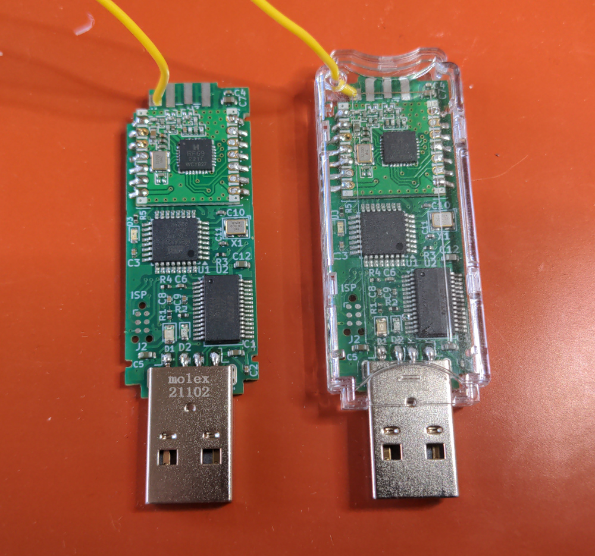

# Foxis JeeLink-clone

## Intro

JeeLinks are transceivers with a microcontroller, that can be
attached to the USB port of a PC. They were designed many
years ago by JeeLabs a.k.a. Jean-Claude Wippler, and like all
of the (many!) cool designs on his now sadly defunct weblog
under jeelabs.org, they were completely Open-Source-Hardware -
while there was a webshop where you could buy ready-made
JeeLinks if you were lazy, you could also just build them
yourself, or modify the designs.

I use many JeeLinks as receivers for my various "FoxTemp"
sensors like foxtemp2016 or foxtemp2024. For that, the
JeeLink is flashed with the "LaCrosse" sketch developed
by the FHEM project (with one minor source code modification
needed to adapt the settings) and attached to a PC, where
a little deamon makes the received data available for query
via network.

Unfortunately, by now jeelabs.org is completely defunct and
you can only access the treasure trove of information that used
to be hosted there through archive.org. The webshop is still
there, but it is in the UK - and thanks to Brexit, ordering
from there to mainland Europe promises to be so painful that
I want to avoid it at all cost.

So where do I get my JeeLinks now?
Well the plan is to do what I've been doing a lot recently:
Design a PCB with mostly SMD components on one side, and
send it off to china for fabrication. And you may ask,
"Wait, doesn't that have the same problems as ordering
from the UK?", and of course in both cases it means crossing
the border from outside the EU into the EU taxation and
customs union. The difference is that the chinese fab
is registered as a so called IOSS, Import One Stop Shop.
That means (as of July 2024) that for any orders below 150
Euro the shop will directly collect the applicable VAT
and transfer it to EU customs. As orders below 150 Euro
are exempt from taxes other than VAT, that means everything
has already been paid when your parcel enters the EU.
And that makes a huge difference, because most parcel services
massively rip you off with the tax handling. For example,
DHL Express will charge a "Kapitalbereitstellungs-
Provision" of (at least) a whopping 14.88 Euros, even if
there was just a single cent of VAT to be paid for the
import, for borrowing you the money for two days. It's
also not possible to opt out of their shitty disservice
and just collect the parcel yourself at the next customs
office. But if there is no VAT or other taxes to be
paid, your parcel just arrives without the ripoff.

Note that this is NOT a full JeeLink clone. My goal
was to have something that works with the FHEM-LaCrosse-
Sketch so I don't have to touch that firmware. But
apart from that, I saw no reason to stay too true to
the original,  so a few modifications have been made:
- proper JeeLinks also have an extra 16 Mbit flash
  memory chip. That is not used by the LaCrosse sketch,
  so I left it out.
- JeeLinks have an ultrabright blue LED that massively
  annoyed me (I don't like getting blind from accidently
  looking at the stick. I also don't need it to
  illuminate the whole room.), so it was replaced with
  a very ordinary and certainly not ultrabright yellow
  LED.
- this did not import the old design files (which were
  in a very old Eagle file format that I couldn't get
  imported) and instead started from scratch in Kicad,
  so the positioning of things like LEDs is entirely
  different.
- When these things come from the factory, they have
  no bootloader that would permit programming them via
  USB yet. So we need to use ISP, but a normal-sized ISP
  connector is way too large to fit, and I didn't want to
  construct my own adapter. So instead, I put a
  "Tag-Connect" 6 pin connector there that is
  easily temporarily attachable with one of their
  cables. Unfortunately, these cables are very
  expensive, but they seem to work quite well.  
- I wanted the ability to attach either a wire antenna
  (like on normal JeeLinks) or something better, so
  it's optionally possible to solder on an SMA
  connector. However, my first tests indicate that
  this is not worth it - it does not improve reception
  that much, at least not in my usecases. And you
  will have to drill a big hole into the case if
  you want to use that.

Current status: A revision 0 was ordered from JLCPCB.
Unfortunately, it contained a very dumb mayor error,
that made it completely non-functional. So a
revision 1 was ordered, that fixed the mayor flaw and
also made some improvements to the outer dimensions
to better fit the case. This revision seems to work
very well. This project is now considered finished.

For your entertainment, here is a picture of the
botched repair of a revision 0 board to make it
work:

## Hardware

This consists of a board with an ATMEGA328P AVR,
an FT232RL USB-to-serial converter chip, and some
other minor parts like LEDs, caps and resistors
that I will not list here - take a look at the
Kicad files, or the "BOM"-file in the production
data. This board was assembled by a cheap SMT PCB
fab, namely JLCPCB. Note that the board is so small
that it actually violates their recommended error
margins in quite a few places, like distance of
soldering pads from the edge of the board, so if
things go badly, you might have problems with e.g.
cut pads and you really can't complain about that.
I was really counting on the fact that they are
usually far better than they claim to be, and it
worked out for me.

Besides the ready made boards, there are three
additional parts that would be very expensive to
assemble at JLCPCB because they are not standard
SMT parts, so these were soldered on manually
later. These parts are:

* a HopeRF RFM69CW wireless radio module
* a Molex 48037-2200 USB (USB-A) connector
* either a 82mm wire antenna, or a SMA connector
  (I used Adafruit 1865) for connecting up an
  external antenna

Optional but highly recommended is also a case.
The whole thing was designed so it fits into
a Bud Industries USB-7201-C enclosure. (The original
Jeelink also used either that or something that
looked VERY similiar.) This enclosure does have a
small hole at the end that is obviously intended
to attach a lanyard, however we can abuse this to
get the small wire antenna out of the case, and the
soldering point for the wire antenna has been
strategically placed for this.
Unfortunately this hole actually has a plastic tube
going through all the way from one side to the other,
so you'll have to break a little bit of the plastic
to get the wire in - the picture below shows how I
did this with a cutter. You really don't need to
break out the whole thing, just enough for the wire
to get through.

Finally, this is how it looks like when fully assembled,
without the enclosure on the left, and with the
enclosure on the right:

## Programming

As this will arrive without any bootloader, there
really is no way to get any firmware onto this
thing without doing ISP programming of the AVR chip
on the board at least once.

You then have the choice to either directly program
the main firmware you want to put on it via ISP, or
instead program the
["Optiboot" bootloader](https://github.com/Optiboot/optiboot),
that will then allow you to reprogram the main firmware
as often as you like over USB, but cost you 512 bytes
of Flash space.

Note that the 'VCC' pin on the ISP connector of the
board is not connected. You will therefore need to
power the board through USB even for the ISP programming.
You also need to make really sure your programmer is set
to 3.3V, else you will fry the radio module.

I used my trusty old STK500 (with v2 firmware) to
program Optiboot. You will need to adapt the below for
other programmers. The sequence I used was:

<pre>cd optibootcheckoutdir/optiboot/bootloaders/optiboot
make LED=B1 AVR_FREQ=16000000 BAUD_RATE=57600 LED_START_FLASHES=5 atmega328
avrdude -c stk500v2 -P /dev/ttyUSB0 -p m328p -e -u -U lock:w:0xEF:m -U efuse:w:0xFD:m -U hfuse:w:0xDE:m -U lfuse:w:0xFF:m -U flash:w:optiboot_atmega328.hex -U lock:w:0xEF:m</pre>

After that, this thing basically behaves like a normal
Jeelink would, and flashing the main firmware on was simply
done via its own USB port (for avrdude this is an "arduino"
programmer at 57600 baud).

## Files

You can find the Kicad files in [the kicad directory of this repository](./kicad/foxis-jeelink-clone/).

The production files (GERBER, BOM, CPL) that were sent to JLCPCB are in [the jlcpcb/production_files subdirectory](./kicad/foxis-jeelink-clone/jlcpcb/production_files/).

Finally, so you don't have to open Kicad just to take a quick look, there is a PDF of the schematic and of the PCB in [the pdf directory](./pdf/). There are also two images from the 3D viewer in Kicad: [3D viewer front](./pics/foxis-jeelink-clone-3dv-front.png) [3D viewer back](./pics/foxis-jeelink-clone-3dv-back.png).

